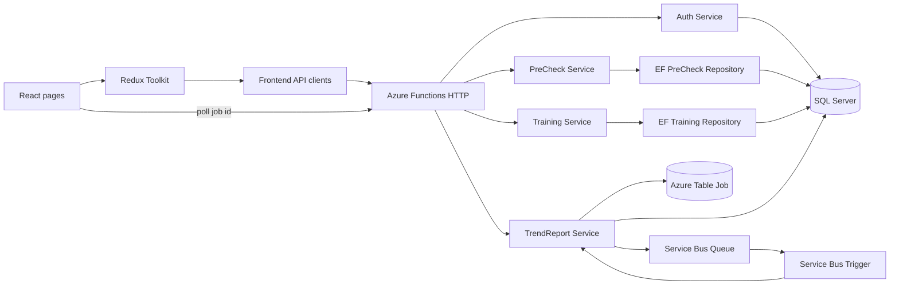

# liftBattery

liftBattery 是一个面向认真训练者的训练运营 Dashboard。它把 readiness、训练负荷、动作表现和恢复信号组织成可追踪的日常记录与趋势报告，但不提供医学诊断，也不替代教练。

Canonical repository:

```text
C:\Users\dddww\Documents\Codex\liftBattery
```

## 当前状态

项目已经不再是纯静态 mock 前端。当前实现包含 React 前端、.NET 8 Azure Functions API、SQL Server 持久化、Azure Service Bus 异步任务和 Azure Table Storage Job 状态。

| 模块 | 当前实现 | 数据位置 | 状态 |
|---|---|---|---|
| Landing / Overview | React 页面、训练运营指标与解释 | 前端状态 + API 数据 | 已实现 |
| Authentication | Closed beta 注册、登录、登出、`/auth/me`、profile update、session cookie | SQL Server `Users` / `AuthSessions` | 已实现 |
| PreCheck | 前后端 API、按日期读取、日期范围读取、upsert、删除、loading/error UI | SQL Server | M1 已完成 |
| Training | 前后端 API、Redux thunk、保存/读取/删除 | SQL Server `TrainingDays` / `TrainingSessions` / `TrainingExercises` / `TrainingSets` | M2 已完成 |
| Trends | 创建/复用异步报告 Job、Service Bus Queue、后台 Consumer、状态轮询、图表结果 | Azure Table Storage + Service Bus + SQL snapshot | 已实现 |
| Weekly Review | 页面/产品概念存在；当前重点是 Trends 异步报告 | 后续确认 | M3 计划 |

## 技术栈

- Frontend: React 18, TypeScript, Vite, Redux Toolkit, Recharts, Tailwind CSS
- Backend: .NET 8 isolated Azure Functions
- Relational persistence: Entity Framework Core 8 + SQL Server
- Async processing: Azure Service Bus Queue
- Job state: Azure Table Storage / Azurite
- Tests: xUnit + SQLite relational test provider, Vitest
- Local infrastructure: Docker Desktop, SQL Server 2022 container, Azurite

## 当前架构



重要边界：PreCheck 和 Training 的普通 CRUD 保持同步 HTTP。Service Bus 只用于耗时、可排队、可重试的趋势报告任务。

## PreCheck M1

M1 将 PreCheck 从 `ConcurrentDictionary` 替换为真实关系型数据库持久化。

### 已完成能力

- 使用 EF Core `LiftBatteryDbContext`
- SQL Server `PreChecks` 表
- 数据库唯一索引 `UserId + PreCheckDate`
- 同一用户同一天第二次保存执行 update，保留原 Id 和 CreatedAtUtc
- 保存 UI 使用的全部原始字段：睡眠时长、酸痛、动力、静息心率变化、上次训练 RPE、上次训练时长
- `CreatedAtUtc` 和 `UpdatedAtUtc` 使用 UTC
- 支持按日期、日期范围读取
- Repository 和 Service 支持 `CancellationToken`
- API Entity、Domain Model、DTO 与前端类型保持分层
- 前端不再用 localStorage 作为 PreCheck 历史记录的数据源
- 兼容旧版 1-5 分 PreCheck DTO 字段

### 数据表

| Column | Purpose |
|---|---|
| `Id` | 记录主键 |
| `UserId` | 开发期用户边界 |
| `PreCheckDate` | 业务日期 |
| `SleepHours` | 睡眠时长 |
| `Soreness` | 1-10 酸痛评分 |
| `Motivation` | 1-10 动力评分 |
| `RestingHeartRateDelta` | 静息心率变化 |
| `PreviousSessionRpe` | 上次训练 RPE |
| `PreviousSessionDurationMinutes` | 上次训练时长 |
| `CreatedAtUtc` | 创建时间 |
| `UpdatedAtUtc` | 更新时间 |

Migration:

```text
20260625140807_AddPreCheckAndTrainingPersistence
```

## HTTP API

默认 base URL 为 `http://localhost:7071/api`。

| Method | Route | Description |
|---|---|---|
| POST | `/auth/register` | Closed beta 注册；成功后写入 session cookie |
| POST | `/auth/login` | 登录；成功后写入 session cookie |
| POST | `/auth/logout` | 登出并清除 session cookie |
| GET | `/auth/me` | 获取当前登录用户 |
| PUT | `/users/me` | 更新 profile、训练目标、单位、每周目标训练天数 |
| GET | `/precheck/today` | 获取当前 UTC 日期的 PreCheck |
| GET | `/precheck?date=yyyy-MM-dd` | 按日期获取 PreCheck |
| GET | `/prechecks?from=yyyy-MM-dd&to=yyyy-MM-dd` | 获取日期范围内的 PreCheck |
| POST | `/precheck` | 创建或更新某日 PreCheck |
| DELETE | `/precheck/{id}` | 删除 PreCheck |
| GET | `/trainingdays?from=...&to=...` | 获取训练日和训练记录 |
| POST | `/trainingdays/sessions` | 保存一次训练 session |
| DELETE | `/trainingsessions/{id}` | 删除训练记录 |
| POST | `/trendreports` | 创建/复用异步趋势报告 Job，返回 202 |
| GET | `/trendreports/{id}` | 查询报告状态和结果 |

除注册/登录外，业务 API 通过 auth session cookie 找到当前用户；未登录时返回 401。`PreCheck__DefaultUserId` 和 `Training__DefaultUserId` 只保留为开发期配置，不应当当作正式认证边界。

## Trends Azure Service Bus 流程

1. 前端提交训练周期、可选对比周期、动作选择和报告类型。
2. `TrendReportFunctions` 调用 `TrendReportService.CreateAsync`。
3. Service 验证请求并读取 Training 与 PreCheck 快照。
4. Service 用 `request + snapshot` 生成 `reportFingerprint`。
5. 如果当前用户已有相同 fingerprint 的 `Queued` / `Processing` job，直接返回已有 job，不再 enqueue。
6. 如果已有 active job 但 fingerprint 不同，说明用户改了报告输入或底层数据快照；旧 job 标记为 `Cancelled`。
7. `TrendReportJobRepository` 将新的 Queued Job 写入 Azure Table。
8. `TrendReportServiceBusQueue` 只把 `jobId` 放入 `trend-report-jobs` Queue。
9. `ProcessTrendReportJob` Service Bus Trigger 调用 `ProcessAsync`。
10. Consumer 以 ETag 保护的方式 claim Job，跳过 `Completed` / `Cancelled` / fresh `Processing` job。
11. Consumer 在写入进度和结果前再次检查是否已 `Cancelled`，避免旧 worker 覆盖新状态。
12. 结果写回 Azure Table；前端按 job id polling，直到 `Completed` / `Failed` / `Cancelled`。

这个流程的业务含义：

- 同一份报告生成中重复点击：返回同一个 active job，不发送新的 Service Bus message。
- 报告生成中用户改了训练数据或筛选条件：旧 job 取消，新 job 入队。
- 已经进入 Service Bus 的旧 message 不会物理删除；它被消费时会读取 Table job 状态，看到 `Cancelled` 后直接 no-op。

当前生成的图表类型：

- readiness
- sleep
- session load
- volume load
- estimated PR
- muscle stimulation

## Repository layout

```text
liftBattery/
  backend/
    LiftBattery.Api/          Azure Functions API
      Data/                   EF Core DbContext, Entity, migration
      DTOs/
      Functions/
      Mapping/
      Models/
      Options/
      Repositories/
      Services/
    LiftBattery.Api.Tests/    M1 backend tests
  client/                     React + TypeScript frontend
  docs/                       Product and architecture notes
  api/                        Historical placeholder; active API is under backend/
  docker-compose.yml          Currently builds the frontend only
```

## Local development

### Prerequisites

- Node.js and npm
- .NET 8 SDK
- Azure Functions Core Tools 4
- Docker Desktop
- Azurite for local Azure Storage
- Azure Service Bus namespace and Queue when testing the full Trends flow

### 1. Install dependencies

```powershell
cd C:\Users\dddww\Documents\Codex\liftBattery\client
npm install

cd ..\backend\LiftBattery.Api
dotnet restore
```

### 2. Start local SQL Server

The current local setup uses SQL Server 2022 in Docker on port `14333`.

```powershell
$env:LIFTBATTERY_SQL_PASSWORD = "choose-a-strong-local-password"

docker volume create liftbattery-sql-data
docker run -d `
  --name liftbattery-sql `
  --restart unless-stopped `
  -e ACCEPT_EULA=Y `
  -e MSSQL_PID=Developer `
  -e MSSQL_SA_PASSWORD=$env:LIFTBATTERY_SQL_PASSWORD `
  -p 14333:1433 `
  -v liftbattery-sql-data:/var/opt/mssql `
  mcr.microsoft.com/mssql/server:2022-latest
```

For an existing container:

```powershell
docker start liftbattery-sql
```

### 3. Configure the backend

Copy the example without committing the real file:

```powershell
Copy-Item .\backend\LiftBattery.Api\local.settings.example.json `
  .\backend\LiftBattery.Api\local.settings.json
```

For the Docker SQL instance, set `ConnectionStrings__LiftBatteryDatabase` in `local.settings.json` to:

```text
Server=127.0.0.1,14333;Database=LiftBattery;User Id=sa;Password=<local-password>;TrustServerCertificate=True;Encrypt=False
```

Important settings:

| Setting | Purpose |
|---|---|
| `ConnectionStrings__LiftBatteryDatabase` | SQL Server connection for auth, PreCheck and Training |
| `PreCheck__DefaultUserId` | Legacy/default development user id |
| `Training__DefaultUserId` | Legacy/default development user id |
| `Auth__BetaInviteCode` | Closed beta registration invite code |
| `Auth__RequireSecureCookie` | Use secure auth cookies; local HTTP development usually sets `false` |
| `Auth__SessionDays` | Auth session lifetime in days |
| `AzureWebJobsStorage` | Functions host and Azure Table connection |
| `ServiceBusConnection` | Azure Service Bus connection |
| `TrendReportQueueName` | Defaults to `trend-report-jobs` |
| `TrendReportTableName` | Defaults to `TrendReportJobs` |
| `TrendReportDemoDelayMilliseconds` | Optional artificial delay so local progress UI is visible |

Do not commit real connection strings or passwords.

### 4. Apply the database migration

```powershell
$env:ConnectionStrings__LiftBatteryDatabase = "<same SQL connection string>"

dotnet ef database update `
  --project .\backend\LiftBattery.Api\LiftBattery.Api.csproj `
  --startup-project .\backend\LiftBattery.Api\LiftBattery.Api.csproj
```

### 5. Configure Trends infrastructure

Start Azurite for local Table Storage and configure the Service Bus Queue by following:

```text
backend/LiftBattery.Api/SERVICE_BUS_SETUP.md
```

The Queue name must match `TrendReportQueueName`.

### 6. Run the applications

Backend:

```powershell
cd .\backend\LiftBattery.Api
func start
```

Frontend:

```powershell
cd .\client
Copy-Item .env.example .env
npm run dev
```

Frontend URL: `http://127.0.0.1:5192`

## Build and test

Backend:

```powershell
dotnet build .\backend\LiftBattery.Api\LiftBattery.Api.csproj
dotnet test .\backend\LiftBattery.Api.Tests\LiftBattery.Api.Tests.csproj
```

Frontend:

```powershell
cd .\client
npm run build
npm test
```

Automated coverage includes:

- first save creates a record
- same user/date updates the original record
- database unique index rejects duplicates
- different users may save the same date
- user/date lookup
- persistence across DbContext instances
- invalid DTO validation
- invalid JSON returns HTTP 400
- frontend DTO round-trip preserves all six UI fields
- legacy DTO compatibility

## Roadmap

### M1 - PreCheck SQL persistence

Status: completed.

### M2 - Training SQL persistence

Owner: user.

Status: completed.

Completed work:

- replaced in-memory training storage with EF Core `TrainingRepository`
- persisted `TrainingDay`, `TrainingSession`, `TrainingExercise` and `TrainingSet`
- added user/date ownership and database constraints
- moved Training read/save/delete flow onto authenticated API calls
- Trend reports now read SQL-backed Training data for snapshots

### M3 - Weekly Review integration

Owner: user + Codex.

Planned work:

- decide whether Weekly Review remains separate from Trends or becomes a saved/exported Trend report view
- improve generated report UX and report content selection
- add stronger operational visibility for Service Bus jobs
- preserve the existing Service Bus Job flow
- consider Blob export only as a later, explicit extension

### Later production hardening

- real authentication and authorization
- per-user data isolation from authenticated claims
- Azure SQL deployment configuration
- Service Bus retry/DLQ monitoring and alerts
- automated integration tests against SQL Server and Azure emulators
- Blob/PDF/CSV export if product scope confirms it

## Product boundaries

liftBattery does not claim:

- medical diagnosis
- RED-S or overtraining syndrome diagnosis
- exact hypertrophy measurement
- exact recovery capacity measurement
- PED or drug advice
- coach replacement

Readiness and risk outputs are evidence-informed heuristics and should be presented as decision support, not physiological truth.

## Evidence references

- Session-RPE training load: https://pmc.ncbi.nlm.nih.gov/articles/PMC5673663/
- Subjective wellness monitoring: https://bjsm.bmj.com/content/50/5/281
- RIR/RPE autoregulation: https://link.springer.com/article/10.1007/s40279-020-01330-8
- RIR-based RPE in resistance training: https://www.frontiersin.org/journals/physiology/articles/10.3389/fphys.2018.00247/full
