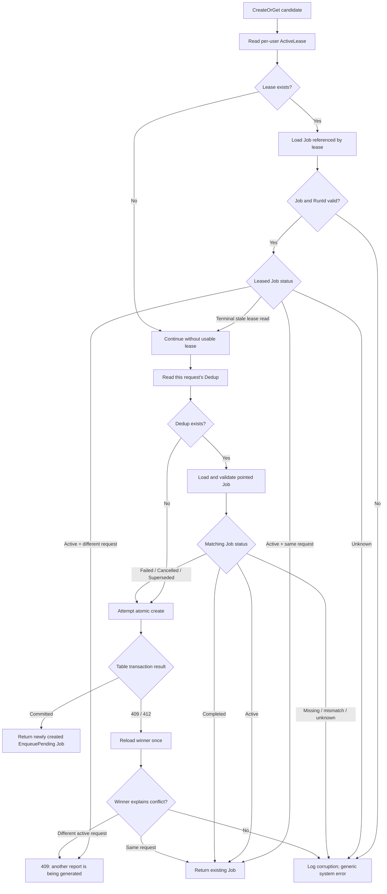

# Trend report CreateOrGet case design

## Product rules

CreateOrGet enforces two different rules:

1. **Request deduplication**: the same `user + DataVersion + report parameters` returns the same logical Job.
2. **One active report per user**: while one Job is `EnqueuePending`, `Queued`, or `Processing`, a different request receives a product-level `409 Conflict`.

There is no automatic replacement of a failed active run and no retry loop that can create an unlimited chain of replacement Jobs. `Failed`, `Cancelled`, or `Superseded` is terminal; a later explicit Generate action may create one new Job.

## Stored rows

All rows for a user share one Azure Table partition so creation can use one atomic transaction.

| Row | RowKey | Stored purpose |
| --- | --- | --- |
| Job | `JobId` as GUID text | Durable state, request, RunId, DataVersion, and result Blob pointer |
| Dedup | `dedup:` + SHA-256 | Points the exact logical request to `JobId` |
| ActiveLease | one fixed RowKey | Points the user's single active slot to `JobId + RunId` |

The dedup hash source is:

```csharp
var dedupSource = string.Join(
    "\n",
    newJob.DataVersion,
    request.StartWeek,
    request.EndWeek,
    request.ComparisonStartWeek,
    request.ComparisonEndWeek);

var dedupHash = Convert.ToHexString(
    SHA256.HashData(Encoding.UTF8.GetBytes(dedupSource)));
```

The dedup row itself does not repeat UserId, DataVersion, or parameters. User identity is in the partition key; DataVersion and parameters are validated against the Job after following the pointer. This validation detects both corruption and a theoretical SHA-256 collision.

## Top-level method

```csharp
public async Task<CreateOrGetTrendReportJobResult> CreateOrGetAsync(
    NewTrendReportJob newJobCandidate,
    CancellationToken cancellationToken = default)
{
    var createState = await LoadCreateStateAsync(
        newJobCandidate,
        cancellationToken);
    var existingResult = EvaluateCreateState(createState);

    if (existingResult is not null)
    {
        return existingResult;
    }

    var createdJob = CreateNewJob(newJobCandidate);
    return await PersistNewJobAsync(
        newJobCandidate,
        createdJob,
        createState,
        cancellationToken);
}
```

The method has three phases: load authoritative rows, evaluate business cases, then attempt one atomic create.

## Phase 1: read ActiveLease first

`LoadCreateStateAsync` reads the per-user lease before this request's dedup row. This order gives later reads a clear interpretation and avoids repeatedly trying to construct a cross-row snapshot.

### ActiveLease exists

The repository follows the lease to its Job and validates `JobId + RunId`.

- Missing Job -> storage corruption; throw an internal exception.
- RunId mismatch -> storage corruption/stale execution pointer; throw an internal exception.
- Unsupported Job status -> internal exception rather than guessing.
- Terminal Job -> the lease read was stale across an atomic terminal update; continue as if no usable lease was observed.
- Active Job with same DataVersion and parameters -> return that Job.
- Active Job with different DataVersion or parameters -> throw `TrendReportActiveJobExistsException`, mapped to a user-safe 409.

The key comparison is intentionally against the leased Job:

```csharp
private static bool JobMatchesRequest(
    NewTrendReportJob candidate,
    TrendReportJob job)
{
    return job.DataVersion == candidate.DataVersion
        && job.Request == candidate.Request;
}
```

No dedup read is needed while a valid active lease is authoritative.

### Why a terminal leased Job is not corruption

This interleaving is valid:

```text
Submit reads ActiveLease
Worker atomically marks Job Completed and deletes ActiveLease
Submit reads the leased Job and sees Completed
```

The submit request observed a stale lease, not an orphan. It proceeds to the request-specific dedup path. If the lease were truly still present, the later atomic create would conflict on its fixed RowKey.

## Phase 2: no usable ActiveLease, read this request's Dedup

### Dedup missing

No existing Job is known for this exact DataVersion and parameters. Evaluation returns `null`, allowing one atomic create attempt.

### Dedup points to a missing Job

Dedup and Job are written in the same Table transaction. A pointer without its Job is never a normal no-result case:

```csharp
if (job is null)
{
    throw new InvalidOperationException(
        $"Trend report dedup pointer {dedup.RowKey} references missing job ...");
}
```

The details belong in logs; the API returns a generic system-error prompt without exposing JobId.

### Dedup points to a non-matching Job

After loading the Job, the repository rechecks DataVersion and all normalized request parameters. A mismatch means corrupted storage or hash collision, so it throws a system error instead of returning another request's report.

### Matching Job is active

Return it. This is the expected race:

```text
Tab A reads ActiveLease = null
Tab B atomically creates Dedup + Job + ActiveLease
Tab A reads Dedup and sees Tab B's active Job
```

Tab A's earlier null lease is stale, but the same-request winner is now known and safe to return.

### Matching Job is Completed

Return the immutable completed report. Do not enqueue it again.

### Matching Job is Failed, Cancelled, or Superseded

Do not reuse it. Evaluation returns `null`, so this new explicit user submission may atomically repoint the dedup row to a newly created Job.

This is not background replacement: the terminal Job remains terminal until the user explicitly submits again.

## Phase 3: atomic create

No source-data snapshot is stored during creation. The Table transaction writes only lightweight coordination state:

```csharp
// Add a new dedup row, or ETag-update the existing terminal request's pointer.
actions.Add(dedupAction);

// New Job always starts as EnqueuePending.
actions.Add(new TableTransactionAction(
    TableTransactionActionType.Add,
    ToEntity(createdJob)));

// Fixed RowKey enforces at most one active Job for this user.
actions.Add(new TableTransactionAction(
    TableTransactionActionType.Add,
    ToActiveJobLease(partitionKey, createdJob, now)));
```

Because all Table actions share one partition, either Dedup + Job + ActiveLease all commit or none commit.

## Concurrent create conflict

A `409` or `412` means the candidate transaction wrote no Table rows. Committed state is reloaded once:

```csharp
var latestState = await LoadCreateStateAsync(
    newJobCandidate,
    cancellationToken);
var winningResult = EvaluateCreateState(latestState);

if (winningResult is not null)
{
    return winningResult;
}

throw new InvalidOperationException(
    "A concurrent trend report create transaction could not be resolved ...",
    createException);
```

Outcomes:

- Identical-parameter tab won -> return the winning Job.
- Different-parameter tab won ActiveLease -> return product 409.
- Winner completed before reload -> dedup returns the completed Job.
- State still cannot explain the conflict -> internal error. Do not loop and do not create an implicit replacement.

## Complete decision flow



## User-visible outcomes

| Real user action | Result |
| --- | --- |
| Double-click or same request in two tabs | Both receive the same Job |
| Different parameters while another Job is active | 409 with a user-safe prompt |
| Same request after Completed | Existing report returned immediately |
| Explicit Generate after Failed/Cancelled/Superseded | One new Job may be created |
| Corrupt Dedup/Lease relation | Generic system error; identifiers only in logs |
