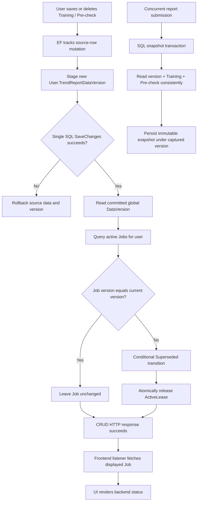

# Trend report DataVersion during Training and Pre-check CRUD

## Chosen consistency model

`TrendReportDataVersion` is a **global per-user source-data generation**. Any successful Training or Pre-check create, update, or delete creates a new version for that user.

The rule is global, not date-range scoped:

```text
same user + same DataVersion + same report parameters = same logical report request
```

This matches the dedup key and worker check. A source change makes every active Job captured from an older version `Superseded`, even when the changed row is outside the Job's selected report dates.

## Why source data and version are both in SQL

The old split design could label old SQL data with a new Azure Table version:

```text
Submit reads old Training data
CRUD commits new Training data
CRUD bumps Table DataVersion to v2
Submit reads v2
Submit persists old snapshot + v2
```

Keeping both the source rows and `User.TrendReportDataVersion` in the same SQL transaction removes that invalid combination.

## CRUD write transaction

Training save stages both changes in the same EF Core unit of work:

```csharp
// Add or update the TrainingDay / TrainingSession entities first.
await _trendReportSourceDataRepository.StageDataVersionChangeAsync(
    userId,
    now,
    cancellationToken);

// One database commit persists both source data and the User version.
await _dbContext.SaveChangesAsync(cancellationToken);
```

Pre-check upsert and both delete paths follow the same rule. `StageDataVersionChangeAsync` deliberately does not save independently:

```csharp
public async Task StageDataVersionChangeAsync(
    int userId,
    DateTimeOffset updatedAtUtc,
    CancellationToken cancellationToken = default)
{
    var user = await _dbContext.Users.SingleOrDefaultAsync(
        candidate => candidate.Id == userId,
        cancellationToken);

    if (user is null)
    {
        throw new InvalidOperationException(...);
    }

    // This tracked change is committed by the source repository's SaveChanges.
    user.TrendReportDataVersion = CreateDataVersion(updatedAtUtc);
}
```

Consequences:

- source write fails -> DataVersion also rolls back;
- DataVersion write fails -> source write also rolls back;
- successful CRUD always has one committed source generation.

The first successful source write initializes the nullable version. Each later mutation replaces it with a timestamp-plus-GUID value.

## Submission snapshot transaction

Submission reads version, Training, and Pre-check within one SQL snapshot-isolation transaction:

```csharp
await using var transaction = await _dbContext.Database.BeginTransactionAsync(
    IsolationLevel.Snapshot,
    cancellationToken);

var dataVersion = await _dbContext.Users
    .AsNoTracking()
    .Where(candidate => candidate.Id == userId)
    .Select(candidate => candidate.TrendReportDataVersion)
    .SingleOrDefaultAsync(cancellationToken);

var trainingDays = await _dbContext.TrainingDays
    .AsNoTracking()
    .Include(day => day.Sessions)
        .ThenInclude(session => session.Exercises)
            .ThenInclude(exercise => exercise.Sets)
    .Where(day => day.UserId == userId && day.Date >= from && day.Date <= to)
    .ToListAsync(cancellationToken);

var preChecks = await _dbContext.PreChecks
    .AsNoTracking()
    .Where(item => item.UserId == userId)
    .Where(item => item.PreCheckDate >= from && item.PreCheckDate <= to)
    .ToListAsync(cancellationToken);

await transaction.CommitAsync(cancellationToken);
```

A concurrent CRUD is observed as either:

- old Training + old Pre-check + old version; or
- new Training + new Pre-check + new version.

It cannot produce a mixed snapshot or attach the wrong version.

## Eager active-Job invalidation

After the SQL repository has committed, the application service invokes:

```csharp
await _trendReportInvalidationService.InvalidateForReportDataChangeAsync(
    userId,
    cancellationToken);
```

The invalidation service reads the committed global version and supersedes every active Job whose stored version differs:

```csharp
var currentDataVersion = await _sourceDataRepository.GetCurrentDataVersionAsync(
    userId,
    cancellationToken);
var activeJobs = await _jobRepository.GetActiveByUserIdAsync(
    userId,
    cancellationToken);

foreach (var job in activeJobs)
{
    if (job.DataVersion == currentDataVersion)
    {
        continue;
    }

    await _jobRepository.TryMarkSupersededIfCurrentAsync(
        userId,
        job.RunId,
        job.Id,
        job.DataVersion,
        cancellationToken);
}
```

This update is conditional. If a worker completed or another action terminally changed the Job after the active-job query, the stale invalidation attempt returns `false` and does not overwrite the terminal winner.

The worker repeats the global version check before processing and before completion. This is necessary because CRUD and invalidation are not part of the Azure Table transaction: a worker may run in the small interval after SQL commits but before eager invalidation reaches the Job.

## Frontend behavior

The client no longer invents an `Outdated` status. After any successful Training or Pre-check save/delete, listener middleware reloads the currently displayed Job:

```ts
startAppListening({
  matcher: isAnyOf(
    saveTrainingSession.fulfilled,
    deleteTrainingSession.fulfilled,
    savePreCheck.fulfilled,
    deletePreCheckLog.fulfilled,
  ),
  effect: async (_action, listenerApi) => {
    const jobId = listenerApi.getState().trendReport.job?.id;

    if (jobId) {
      await listenerApi.dispatch(fetchTrendReportJob(jobId));
    }
  },
});
```

The backend is the status authority. Active old-version Jobs are returned as `Superseded`. Completed Jobs remain immutable historical reports; a later Generate request captures the new DataVersion and therefore uses a different dedup key.

## End-to-end flow



## Invariants

- Only source-data CRUD creates or advances DataVersion; Job creation only reads it.
- DataVersion and source mutation commit in one SQL transaction.
- Submission captures version and both source collections in one SQL snapshot transaction.
- Invalidation and worker processing use the same global per-user rule.
- The frontend never fabricates a report status.
