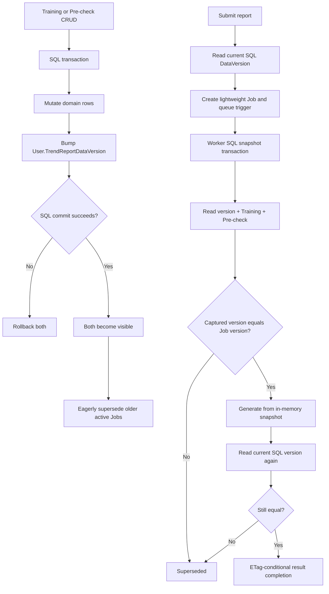

# Trend report DataVersion and SQL source snapshots

## Invariant

`User.TrendReportDataVersion` is the authoritative global source-data generation for one user. Only successful Training or Pre-check CRUD advances it.

```text
same user + same DataVersion + same normalized report parameters
= same logical trend-report request
```

The Service Bus message is never a DataVersion authority. It contains only `UserId`, `JobId`, and `RunId`, which are enough to locate the durable Job run.

## CRUD transaction

Each source mutation stages a new version on the tracked SQL User before the caller commits:

```csharp
_dbContext.TrainingSessions.Remove(session);

await _trendReportSourceDataRepository.StageDataVersionChangeAsync(
    userId,
    DateTimeOffset.UtcNow,
    cancellationToken);

await _dbContext.SaveChangesAsync(cancellationToken);
```

`StageDataVersionChangeAsync` deliberately does not call `SaveChangesAsync`:

```csharp
public async Task StageDataVersionChangeAsync(
    int userId,
    DateTimeOffset updatedAtUtc,
    CancellationToken cancellationToken = default)
{
    var user = await _dbContext.Users.SingleOrDefaultAsync(
        candidate => candidate.Id == userId,
        cancellationToken);

    if (user is null)
    {
        throw new InvalidOperationException(
            $"Cannot update trend report DataVersion because user {userId} does not exist.");
    }

    user.TrendReportDataVersion = CreateDataVersion(updatedAtUtc);
}
```

Consequently the domain write and version bump have one SQL commit boundary:

```text
source write fails     -> DataVersion rolls back
DataVersion write fails -> source mutation rolls back
both succeed           -> both become visible together
```

## Submission

Submission validates the request and reads only the current SQL version:

```csharp
var dataVersion = RequireCurrentDataVersion(
    await _sourceDataRepository.GetCurrentDataVersionAsync(
        userId,
        cancellationToken));

var candidate = new NewTrendReportJob(
    userId,
    "Submitting report job",
    request,
    runId,
    dataVersion);
```

No Training/Pre-check rows are copied into the Job, and no snapshot Blob is created. The captured version remains part of the Job and dedup identity.

If CRUD commits after this read but before Job creation, the Job keeps the older version. The worker detects that mismatch during version check 1 and supersedes the Job without generating a report.

## Worker version check 1 and snapshot creation

At execution start, `CaptureSnapshotAsync` reads the current version, Training, and Pre-check rows inside one SQL snapshot-isolation transaction:

```csharp
await using var transaction = await _dbContext.Database.BeginTransactionAsync(
    IsolationLevel.Snapshot,
    cancellationToken);

var dataVersion = await _dbContext.Users
    .Where(user => user.Id == userId)
    .Select(user => user.TrendReportDataVersion)
    .SingleOrDefaultAsync(cancellationToken);

var trainingDays = await LoadTrainingDaysAsync(...);
var preCheckLogs = await LoadPreChecksAsync(...);

await transaction.CommitAsync(cancellationToken);
```

The worker compares the captured SQL generation with the durable Job:

```csharp
if (job.DataVersion != sourceDataCapture.DataVersion)
{
    await _jobRepository.TryMarkSupersededIfCurrentAsync(...);
    return;
}

var snapshot = sourceDataCapture.Snapshot;
```

The snapshot is immutable in memory for that processing attempt. A Service Bus redelivery recaptures it; if the SQL generation is unchanged, it observes the same committed generation. If the version changed, the delivery becomes a stale no-op.

## Worker version check 2

After calculation and immediately before terminal persistence, the worker reads the SQL version again:

```csharp
var currentDataVersion = await _sourceDataRepository.GetCurrentDataVersionAsync(
    job.UserId,
    cancellationToken);

if (job.DataVersion != currentDataVersion)
{
    await _jobRepository.TryMarkSupersededIfCurrentAsync(...);
    return;
}

await _jobRepository.TryCompleteIfCurrentActiveAsync(
    job.UserId,
    job.Id,
    job.RunId,
    job.DataVersion,
    result,
    cancellationToken);
```

This avoids publishing a result when CRUD changed the source during calculation. The Table completion is additionally guarded by JobId, RunId, DataVersion, active status, and ETag.

SQL and Azure Table/Blob cannot participate in one transaction. Therefore the final SQL read is adjacent to, but not atomic with, the Azure completion write. Absolute cross-store atomicity would require moving the Job completion record into SQL or introducing a transactional SQL completion/outbox design.

## CRUD invalidation

After a CRUD commit, eager invalidation reads the committed SQL version and conditionally supersedes active Jobs captured from older generations. This reduces wasted worker work, while the worker's two SQL checks remain the correctness fallback when invalidation is delayed or fails.



## Summary

- SQL `User.TrendReportDataVersion` is authoritative.
- Source CRUD and version bump commit together.
- Submission reads the version but does not capture or persist source rows.
- Worker check 1 and snapshot creation share one SQL snapshot transaction.
- Worker calculation uses only that immutable in-memory snapshot.
- Worker check 2 reads SQL immediately before conditional completion.
- Service Bus carries no DataVersion.
