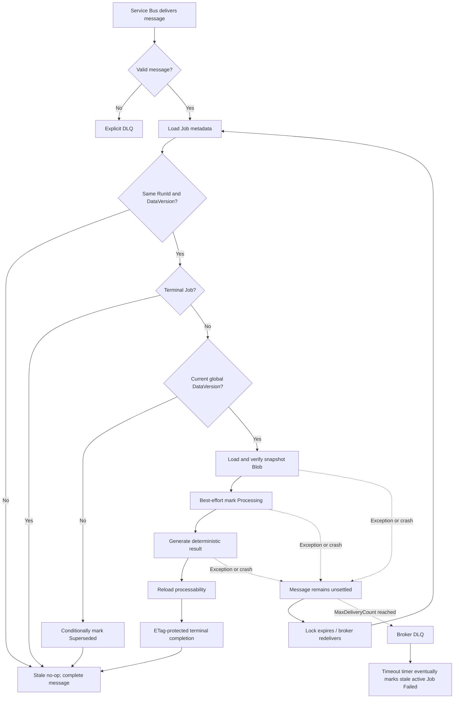

# Trend report message redelivery and Job recovery

## Purpose

The Trend Report worker uses Azure Service Bus PeekLock delivery. A valid message is therefore processed **at least once**, not exactly once. The design allows the same `RunId` to be computed again after a crash while ensuring that only one terminal Job update wins.

There are two separate recovery problems:

1. **Table-to-queue handoff recovery**: a Job was stored as `EnqueuePending`, but the send failed or the process stopped around the send.
2. **Worker redelivery**: Service Bus delivered a valid message, processing failed or the process died, and the broker delivers the same message again.

The first is handled by a timer. The second is owned by Service Bus. A second convergence timer prevents a Job from remaining active forever after broker retries are exhausted or infrastructure is misconfigured.

## Queue Function settlement rule

`TrendReportQueueFunctions.ProcessTrendReportJob` explicitly disables auto-completion:

```csharp
[ServiceBusTrigger(
    "%TrendReportQueueName%",
    Connection = "ServiceBusConnection",
    AutoCompleteMessages = false)]
ServiceBusReceivedMessage message
```

The Function settles messages as follows:

```csharp
var queueMessage = TryReadQueueMessage(message);

if (queueMessage is null || !IsValidQueueMessage(queueMessage))
{
    await messageActions.DeadLetterMessageAsync(...);
    return;
}

// A successful result and an intentional stale/terminal no-op are both success.
await _service.ProcessAsync(queueMessage, cancellationToken);
await messageActions.CompleteMessageAsync(message, cancellationToken);
```

- Invalid JSON or missing required identity fields is permanent input failure, so it is explicitly dead-lettered.
- A valid message is completed only after `ProcessAsync` returns.
- Any exception escapes. The message remains unsettled, its lock eventually expires, and Service Bus redelivers it until the queue's `MaxDeliveryCount` moves it to DLQ.

## Why `Processing` is reprocessable

`Processing` is a UI state, not a worker lease. Consider this timing:

```text
Delivery 1: reads Queued
Delivery 1: changes Job to Processing
Delivery 1: process crashes before completion
Service Bus: lock expires
Delivery 2: reads the same Job in Processing
Delivery 2: recomputes the immutable snapshot and completes it
```

Rejecting `Processing` on Delivery 2 would permanently strand the Job. The processability check therefore accepts all active statuses:

```csharp
if (latestJob.Status is not (
    TrendReportJobStatuses.EnqueuePending
    or TrendReportJobStatuses.Queued
    or TrendReportJobStatuses.Processing))
{
    throw new InvalidOperationException(...);
}
```

The initial state update is best effort:

```csharp
await _trendReportJobRepo.TryStartProcessingAsync(
    message.UserId,
    message.JobId,
    message.RunId,
    message.DataVersion,
    cancellationToken);
```

Two deliveries may both continue. This is intentional. The snapshot is immutable, so duplicate calculation is safe; exclusive ownership is enforced only when publishing a terminal result.

## Terminal write idempotency

Before every important phase, `GetProcessableJobAsync` reloads durable state and checks:

- `JobId`, `RunId`, and `DataVersion` still identify the same execution;
- the Job is still active;
- the Job DataVersion is still the user's current global DataVersion.

Completion then uses the exact identity, active-state predicate, and Azure Table ETag:

```csharp
return await TryUpdateEntityAsync(
    userId,
    jobId,
    expectedRunId,
    expectedDataVersion,
    entity =>
        entity.DataVersion == expectedDataVersion
        && entity.RunId == expectedRunId
        && IsActiveStatus(entity.Status)
        && entity.ErrorMessage is null,
    (entity, now) =>
    {
        entity.Status = TrendReportJobStatuses.Completed;
        entity.ResultBlobName = storedResult.BlobName;
        entity.CompletedAtUtc = now;
    },
    ...);
```

`TryUpdateEntityAsync` updates with `entity.ETag`. If two deliveries race, the first terminal transaction wins and the second receives `412 Precondition Failed`, which is converted to `false`. The second result cannot overwrite the winner.

## Enqueue recovery timer

Blob/Table persistence and Service Bus sending cannot share one transaction. The Job is first committed as `EnqueuePending`; after send, it is conditionally changed to `Queued`.

If the process stops after send but before the state update, recovery may send the same `RunId` again. That duplicate is safe because the worker behavior above is idempotent.

```csharp
var claimedJob = await _trendReportJobRepo.TryBeginEnqueueRecoveryAttemptAsync(
    candidate.UserId,
    candidate.Id,
    candidate.RunId,
    candidate.DataVersion,
    _enqueueRecoveryMaxAttempts,
    cancellationToken);

if (claimedJob is not null)
{
    await EnqueueAndMarkQueuedAsync(claimedJob, cancellationToken);
}
```

The recovery attempt is conditional on the exact run remaining `EnqueuePending`. A bounded retry count eventually marks a persistently unsendable Job `Failed` and releases its active lease.

## Timed-out Job convergence

Service Bus may automatically DLQ a message without application code getting one final callback. A periodic scan therefore finds old `Queued` and `Processing` Jobs and conditionally marks them `Failed`:

```csharp
var candidates = await _trendReportJobRepo.GetTimedOutActiveJobsAsync(
    queuedBeforeUtc,
    processingBeforeUtc,
    maxCount,
    cancellationToken);

foreach (var candidate in candidates)
{
    await _trendReportJobRepo.TryMarkTimedOutIfStillActiveAsync(
        candidate.UserId,
        candidate.Id,
        candidate.RunId,
        candidate.DataVersion,
        queuedBeforeUtc,
        processingBeforeUtc,
        cancellationToken);
}
```

The scan result is only a candidate list. The conditional update re-reads the row and checks identity, status, timestamp, and ETag. A Job completed after the scan cannot be changed back to `Failed`.

## End-to-end flow



## Operational invariants

- Queue `MaxDeliveryCount` must be configured in infrastructure, not assumed by application code.
- `Processing` must remain reprocessable for the same `JobId + RunId + DataVersion`.
- Result generation must remain deterministic for an immutable snapshot.
- Every terminal write must be conditional and release the per-user active lease atomically.
- The timeout window must be longer than the expected maximum legitimate report runtime.
