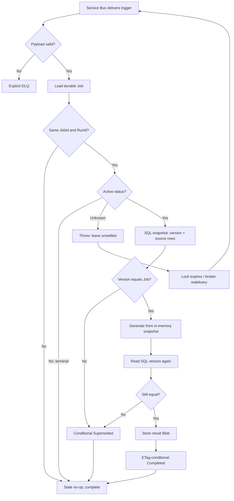

# Trend report message redelivery and Job recovery

## Delivery model

The Trend Report worker uses Azure Service Bus PeekLock delivery. A valid message is processed at least once, not exactly once.

There are two independent recovery problems:

1. Table Job creation succeeded but the initial Service Bus send or the following `Queued` update did not finish.
2. Service Bus delivered a valid message, but processing threw or the process crashed.

The enqueue-recovery timer handles the first. Service Bus redelivery handles the second. A timeout-convergence timer prevents Jobs from remaining active forever after broker retries are exhausted or infrastructure is misconfigured.

## Message settlement

```csharp
var queueMessage = TryReadQueueMessage(message);

if (queueMessage is null || !IsValidQueueMessage(queueMessage))
{
    await messageActions.DeadLetterMessageAsync(...);
    return;
}

await _service.ProcessAsync(queueMessage, cancellationToken);
await messageActions.CompleteMessageAsync(message, cancellationToken);
```

- Invalid messages are explicitly DLQ'd because retry cannot repair their payload.
- A valid message is completed only after `ProcessAsync` returns.
- An unexpected exception escapes; the message remains unsettled and Service Bus redelivers it.
- Intentional stale/terminal outcomes return normally and are completed.

## Lightweight trigger

The queue message contains only `JobId`, `RunId`, and `UserId`. It does not contain DataVersion, request parameters, or source rows.

The durable Job row supplies:

- normalized request parameters;
- the DataVersion captured at submission;
- current status;
- the terminal result pointer when complete.

SQL `User.TrendReportDataVersion` supplies the current authoritative version.

## What a redelivery does

Suppose delivery A changes the Job to `Processing` and the process crashes. Delivery B:

1. loads the same JobId and RunId;
2. accepts `Processing` as reprocessable;
3. opens a SQL snapshot transaction;
4. reads the current DataVersion, Training, and Pre-check rows together;
5. continues only when the captured SQL version equals `Job.DataVersion`;
6. recomputes from the new per-attempt immutable snapshot;
7. checks SQL DataVersion again immediately before completion;
8. competes on the ETag-protected terminal update.

```text
Delivery 1: Queued -> Processing -> process crashes
Service Bus: lock expires
Delivery 2: Processing -> recapture same SQL generation -> compute -> Completed
```

No processing-attempt ownership token is required. Duplicate work is permitted; terminal publication is conditional.

## Conditional completion

```csharp
await _jobRepository.TryCompleteIfCurrentActiveAsync(
    job.UserId,
    job.Id,
    job.RunId,
    job.DataVersion,
    result,
    cancellationToken);
```

The repository:

1. writes the deterministic result to a content-addressed Blob;
2. reloads the Job row;
3. requires matching RunId, DataVersion, active status, and no error;
4. writes `Completed` with the row ETag;
5. releases the per-user ActiveLease in the same Azure Table partition transaction.

Two deliveries may calculate concurrently, but only one terminal transition wins. The other gets a terminal row or ETag precondition failure and returns without replacing the winner.

## Data changes during redelivery

Every processing attempt performs two SQL checks:

- check 1 is part of the SQL snapshot capture and avoids computing from a generation different from the Job;
- check 2 is a scalar SQL read immediately before terminal persistence and discards work if CRUD committed during calculation.

If either check differs, the Job is conditionally marked `Superseded`, the ActiveLease is released, and the message is completed as a stale no-op.

The Service Bus message is not consulted for freshness.

## Enqueue recovery

Job creation atomically persists Job + dedup + ActiveLease as `EnqueuePending`. Service Bus and Azure Table cannot share one transaction, so a timer scans old pending rows:

```csharp
var claimedJob = await _jobRepository.TryBeginEnqueueRecoveryAttemptAsync(
    candidate.UserId,
    candidate.Id,
    candidate.RunId,
    candidate.DataVersion,
    maxAttempts,
    cancellationToken);

if (claimedJob is not null)
{
    await EnqueueAndMarkQueuedAsync(claimedJob, cancellationToken);
}
```

The ETag condition lets one recovery invocation claim an attempt. If the send succeeded but the process crashed before the Table update, recovery may send the same RunId again; normal worker idempotency handles that duplicate.

## Timeout convergence

Service Bus can move a message to DLQ after `MaxDeliveryCount` without invoking application code for a final attempt. A periodic scan finds old `Queued` and `Processing` Jobs and conditionally marks them `Failed`:

```csharp
await _jobRepository.TryMarkTimedOutIfStillActiveAsync(
    candidate.UserId,
    candidate.Id,
    candidate.RunId,
    candidate.DataVersion,
    queuedBeforeUtc,
    processingBeforeUtc,
    cancellationToken);
```

The status, timestamps, RunId, DataVersion, and ETag must still match. A Job that completed or was superseded after the scan is not overwritten.

## Flow



## Required invariants

- JobId is never reused.
- RunId identifies the durable execution referenced by a message.
- SQL is the DataVersion authority; Service Bus carries no version.
- `Processing` remains reprocessable for the same JobId and RunId.
- Each attempt calculates only from its SQL-consistent in-memory snapshot.
- Result publication remains conditional and idempotent.
- Queue `MaxDeliveryCount` is configured in infrastructure, while timeout convergence remains an independent safety net.
