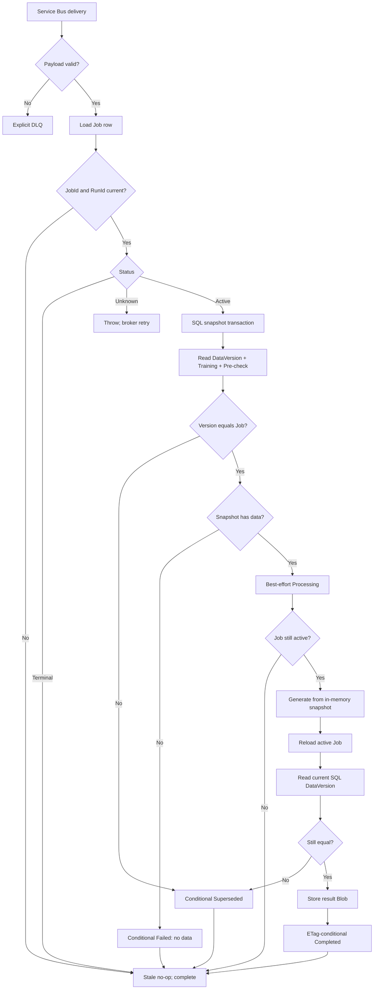

# Trend report worker processing cases

## Queue contract

The Service Bus payload is a lightweight trigger:

```csharp
public sealed record TrendReportQueueMessageDto(
    Guid JobId,
    string RunId,
    int UserId);
```

Processing uses the request and captured DataVersion from the durable Job row. SQL owns the current DataVersion.

## Case 1: invalid queue payload

Malformed JSON or missing required identity fields is explicitly dead-lettered because retry cannot repair it:

```csharp
if (queueMessage is null || !IsValidQueueMessage(queueMessage))
{
    await DeadLetterInvalidMessageAsync(...);
    return;
}
```

## Case 2: missing Job or wrong RunId

The worker first loads lightweight Azure Table state:

```csharp
var latestJob = await _jobRepository.GetByIdAsync(
    message.UserId,
    message.JobId,
    cancellationToken);

if (latestJob is null || latestJob.RunId != message.RunId)
{
    return null;
}
```

This is an intentional stale no-op. The Function completes the message.

## Case 3: terminal Job

`Completed`, `Failed`, `Cancelled`, and `Superseded` are immutable terminal states. Duplicate/redelivered messages return successfully without computation and are completed.

## Case 4: unsupported persisted status

A status outside the active and terminal sets is treated as corruption or an unsupported schema change. The worker throws; the valid message remains unsettled and follows Service Bus redelivery/DLQ policy.

## Case 5: version check 1 and source capture

The worker reads DataVersion, Training, and Pre-check data in one SQL snapshot transaction:

```csharp
var sourceDataCapture = await _sourceDataRepository.CaptureSnapshotAsync(
    job.UserId,
    snapshotStart,
    rangeEnd,
    cancellationToken);

if (job.DataVersion != sourceDataCapture.DataVersion)
{
    await _jobRepository.TryMarkSupersededIfCurrentAsync(...);
    return null;
}

var snapshot = sourceDataCapture.Snapshot;
```

Outcomes:

- different version: conditionally mark `Superseded`, release ActiveLease, complete the message;
- same version with no rows in the selected period: conditionally mark `Failed` with a user-safe no-data message, release ActiveLease, complete the message;
- same version with data: continue with the immutable in-memory snapshot.

No snapshot is stored in Azure Table or Blob Storage.

## Case 6: best-effort Processing transition

```csharp
await _jobRepository.TryStartProcessingAsync(
    job.UserId,
    job.Id,
    job.RunId,
    job.DataVersion,
    cancellationToken);
```

`Processing` is a display state, not a worker lock. Another delivery may already have written it. After this attempt, the worker reloads Table state:

- still active: continue;
- terminal: stop and complete the message;
- missing/wrong RunId: stale no-op.

This Table reload does not query SQL again.

## Case 7: deterministic calculation

```csharp
var result = GenerateResult(job.Request, snapshot);
```

The calculation reads only the per-attempt immutable snapshot. It never queries live Training or Pre-check rows.

## Case 8: version check 2 before completion

Immediately before result persistence, the worker reloads active Job state and reads the current SQL version:

```csharp
var currentDataVersion = await _sourceDataRepository.GetCurrentDataVersionAsync(
    job.UserId,
    cancellationToken);

if (job.DataVersion != currentDataVersion)
{
    await _jobRepository.TryMarkSupersededIfCurrentAsync(...);
    return;
}
```

If unchanged, the repository stores the immutable result Blob and conditionally publishes its pointer:

```csharp
await _jobRepository.TryCompleteIfCurrentActiveAsync(
    job.UserId,
    job.Id,
    job.RunId,
    job.DataVersion,
    result,
    cancellationToken);
```

The Table transition requires matching JobId, RunId, DataVersion, active status, and ETag. A competing cancellation, supersession, timeout, or completion causes the update to lose harmlessly.

The final SQL check and Azure completion are not one distributed transaction. Absolute atomicity across that boundary requires SQL-backed Job completion or a transactional outbox/gate design.

## Case 9: duplicate delivery

Two deliveries for the same RunId may both capture the same SQL generation and calculate. This is safe because:

- source snapshots are isolated and immutable per attempt;
- result Blob names are content-addressed;
- only one ETag-protected terminal update can win;
- the loser observes terminal state or a failed precondition and becomes a no-op.

## Case 10: transient failure or process crash

Any unexpected exception escapes `ProcessAsync`. The Function does not settle the valid message, so Service Bus redelivers it. A `Processing` Job remains eligible for recomputation.

This covers both a caught infrastructure error and a hard process crash where no catch block runs.

## Case 11: exhausted broker retries

Service Bus may DLQ after `MaxDeliveryCount` without giving application code a special final callback. A timer independently scans old `Queued` and `Processing` Jobs and conditionally marks them `Failed`, releasing the active lease.

## Complete flow



## Outcome table

| Observed case | Job action | Message action |
|---|---|---|
| Invalid payload | None | Explicit DLQ |
| Missing Job / wrong RunId | None | Complete |
| Terminal Job | None | Complete |
| Unsupported status | None | Retry, then broker DLQ |
| SQL version differs at start | Conditional Superseded | Complete |
| Selected period has no data | Conditional Failed | Complete |
| SQL version changes during calculation | Conditional Superseded | Complete |
| Duplicate active delivery | Compete on terminal ETag | Complete on return |
| Transient failure / crash | Keep active | Leave unsettled |
| Timed-out active Job | Conditional Failed by timer | Independent of message |
