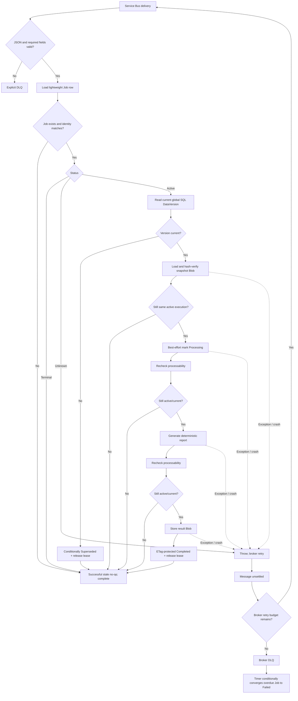

# Trend report processing case design

## Scope

This document covers all outcomes after a Trend Report Service Bus message is delivered: invalid input, stale delivery, cancellation, DataVersion change, duplicate delivery, successful completion, transient failure, and timeout convergence.

## Message identity

The queue message is a compact command:

```csharp
public sealed record TrendReportQueueMessageDto(
    Guid JobId,
    string RunId,
    int UserId,
    string PeriodStart,
    string PeriodEnd,
    string DataVersion,
    DateTimeOffset RequestedAtUtc);
```

The durable Job remains authoritative. `JobId + RunId + DataVersion` identifies the exact execution. Dates in the message are correlation/debugging fields; processing uses the request and immutable snapshot loaded from durable storage.

## Case 1: invalid message

The Function validates deserialization and required identity fields before calling the service.

```csharp
if (queueMessage is null)
{
    await DeadLetterInvalidMessageAsync(..., "InvalidTrendReportQueueMessage", ...);
    return;
}

if (!IsValidQueueMessage(queueMessage))
{
    await DeadLetterInvalidMessageAsync(..., "InvalidTrendReportQueueMessage", ...);
    return;
}
```

Invalid input cannot become valid on retry, so it is explicitly sent to DLQ.

## Case 2: Job missing or execution identity differs

`GetProcessableJobAsync` first loads only the lightweight Table row:

```csharp
var latestJob = await _trendReportJobRepo.GetByIdAsync(
    message.UserId,
    message.JobId,
    cancellationToken);

if (latestJob is null
    || latestJob.RunId != message.RunId
    || latestJob.DataVersion != message.DataVersion)
{
    return null;
}
```

This is an intentional stale no-op. Examples:

- an old message refers to a removed Job;
- a message belongs to a different execution identity;
- an earlier duplicate arrives after durable state moved on.

The service returns successfully and the Function completes the message.

## Case 3: Job is terminal

`Completed`, `Failed`, `Cancelled`, and `Superseded` are immutable terminal states:

```csharp
if (latestJob.Status is TrendReportJobStatuses.Completed
    or TrendReportJobStatuses.Failed
    or TrendReportJobStatuses.Cancelled
    or TrendReportJobStatuses.Superseded)
{
    return null;
}
```

A duplicate delivery after any terminal winner is a successful no-op. It cannot regenerate or overwrite the result.

## Case 4: unsupported status

Only `EnqueuePending`, `Queued`, and `Processing` are processable. An unknown persisted status is treated as a system error:

```csharp
if (!IsActiveJobStatus(latestJob.Status))
{
    throw new InvalidOperationException(...);
}
```

The exception escapes for broker retry and logging rather than guessing whether the state is active or terminal.

## Case 5: source DataVersion changed

Before downloading the snapshot, the worker compares the Job's captured version with the current global SQL version:

```csharp
var currentUserDataVersion = await _sourceDataRepository
    .GetCurrentDataVersionAsync(latestJob.UserId, cancellationToken);

if (latestJob.DataVersion != currentUserDataVersion)
{
    await _trendReportJobRepo.TryMarkSupersededIfCurrentAsync(
        latestJob.UserId,
        latestJob.RunId,
        latestJob.Id,
        latestJob.DataVersion,
        cancellationToken);

    return null;
}
```

The conditional transition releases ActiveLease only if the same execution is still active. The message is then completed as a stale no-op.

This repeats the eager CRUD invalidation rule because SQL and Azure Table cannot participate in one transaction.

## Case 6: snapshot load and integrity verification

Only an identity-valid, active, current-version Job downloads its snapshot Blob:

```csharp
var jobWithSnapshot = await _trendReportJobRepo.GetForProcessingAsync(
    message.UserId,
    message.JobId,
    cancellationToken);
```

The Job row stores `SnapshotBlobName` and `SnapshotHash`; the payload store downloads the Blob and verifies SHA-256 before deserialization. A missing Blob, missing hash, hash mismatch, or invalid JSON throws. The valid message remains unsettled for broker retry and eventually DLQ if the corruption persists.

After the slower Blob read, identity and status are checked again. A cancellation, supersede, or completion that won during the download becomes a no-op.

## Case 7: start processing

The service makes a best-effort transition to `Processing`:

```csharp
await _trendReportJobRepo.TryStartProcessingAsync(
    message.UserId,
    message.JobId,
    message.RunId,
    message.DataVersion,
    cancellationToken);
```

Failure to win this state write does not stop calculation. Another delivery may already have written `Processing`. `Processing` is display state, not exclusive ownership.

## Case 8: cancellation or supersede during calculation

The worker calls `GetProcessableJobAsync` again before generating and again before terminal persistence:

```csharp
if (await GetProcessableJobAsync(message, cancellationToken: cancellationToken) is null)
{
    return;
}

var result = GenerateResult(job.Request, snapshot);

if (await GetProcessableJobAsync(message, cancellationToken: cancellationToken) is null)
{
    return;
}
```

These checks close the asynchronous windows around calculation:

- user cancellation wins -> Job is `Cancelled`; worker exits;
- CRUD wins -> Job/version is `Superseded`; worker exits;
- duplicate worker completes first -> Job is `Completed`; worker exits.

The final conditional update is still required because state can change immediately after the last read.

## Case 9: duplicate delivery completes concurrently

Both deliveries may calculate the same immutable snapshot. Results are stored content-addressably, then completion is attempted conditionally:

```csharp
await _trendReportJobRepo.TryCompleteIfCurrentActiveAsync(
    message.UserId,
    message.JobId,
    message.RunId,
    message.DataVersion,
    result,
    cancellationToken);
```

The repository requires matching identity, active status, no error, and the ETag read with that row. Only one delivery can change the Job to `Completed` and atomically release ActiveLease. A losing `412` becomes `false`.

## Case 10: transient exception or process crash

`ProcessAsync` does not mark the Job `Failed` on an ordinary attempt exception:

```csharp
catch (OperationCanceledException)
{
    throw;
}
catch (Exception)
{
    // Service Bus owns redelivery and DLQ for valid messages.
    throw;
}
```

The Function does not complete the message. Service Bus redelivers it, and a `Processing` Job is accepted for recomputation. This covers a hard process crash where no catch block executes.

## Case 11: retries exhausted or Job abandoned

Service Bus can move a message to DLQ after `MaxDeliveryCount` without invoking the application for a special final attempt. A timer independently converges old active Jobs:

```csharp
await _service.ConvergeTimedOutJobsAsync(
    queuedBeforeUtc: now - _queuedJobTimeout,
    processingBeforeUtc: now - _processingJobTimeout,
    maxCount: 50,
    cancellationToken);
```

The final update requires the exact run to still be overdue and active. If a legitimate worker completed after the timer query, ETag and status checks protect its completion.

## Full processing flow



## Outcome table

| Durable state / event | Worker outcome | Message settlement |
| --- | --- | --- |
| Invalid message | No processing | Explicit DLQ |
| Missing/mismatched Job identity | Stale no-op | Complete |
| Completed/Failed/Cancelled/Superseded | Duplicate no-op | Complete |
| Active but old DataVersion | Conditional Superseded | Complete |
| Valid active current Job | Generate and attempt completion | Complete on return |
| Duplicate active deliveries | Both may compute; one terminal writer wins | Both complete if no exception |
| Transient failure or crash | Leave active for redelivery | Unsettled; broker retry |
| Retry budget exhausted | Broker DLQ; timer later converges stale Job | DLQ |
